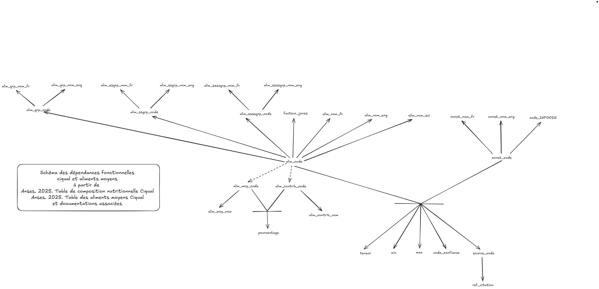
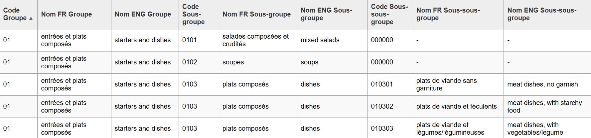
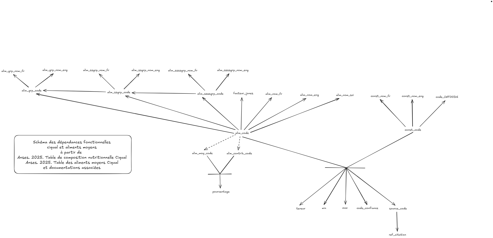

# Conception de la base de données

*Git Hub effectue un mauvais affichage des écritures des DF, préférer un autre éditeur/visualiseur*

## Dépendances fonctionnelles

On note respectivement $U$ et $V$ les relations comprenant l'ensemble des attributs nécessaires à garantir les informations fournies par les deux fichiers de données de ANSEES de Ciqual et des aliments moyens.
Une étude appronfondie a été menée tant sur les données `xml` et `xlsx` que par les fichiers de documentation mis à disposition.

### Dépendances fonctionnelles $U$

À partir de la documentation fournie et des fichiers XML, on déduit les dépendances fonctionnelles afin de constituer un schéma.

#### Aliments groupes

$alim\_grp\_code \rightarrow alim\_grp\_nom\_fr, alim\_grp\_nom\_eng$

$alim\_ssgrp\_code \rightarrow alim\_ssgrp\_nom\_fr, alim\_ssgrp\_nom\_eng$

$alim\_ssssgrp\_code \rightarrow alim\_ssssgrp\_nom\_fr, alim\_ssssgrp\_nom\_eng$

#### Aliments

$alim\_code \rightarrow alim\_nom\_fr, alim\_nom\_eng, alim\_nom\_sci, facteur\_jones$

$alim\_code \rightarrow alim\_grp\_code, alim\_ssgrp\_code, alim\_ssssgrp\_code$

#### Constituant

$const\_code \rightarrow const\_nom\_fr, const\_nom\_eng, code\_infoods$

#### Composition

$(alim\_code, const\_code) \rightarrow teneur, min, max, code\_confiance, source\_code$

#### Sources

$source\_code \rightarrow ref\_citation$

### Dépendance Fonctionnelles $V$

À partir de la documentation fournie et du fichier Excel, on déduit les informations et dépendances fonctionnelles afin de constituer un schéma.

Sachant que :

- $(alim\_moy\_code \cup alim\_contrib\_code) \subset alim\_code$

L'utilisation du symbole $\subseteq$ est impossible du fait des données actuelles.

- $alim\_contrib\_code \cap alim\_moy\_code = \emptyset$

#### Aliments moyens

$alim\_moy\_code \rightarrow alim\_moy\_nom$

$alim\_contrib\_code \rightarrow alim\_contrib\_nom$

$(alim\_moy\_code, alim\_contrib\_code) \rightarrow pourcentage$

### Graphe des dépendances fonctionnelles natives

### Remarques

#### Première remarque

Or, on constate qu'une équivalence entre des DF des aliments moyens et de la table Ciqual existe.

Très justement, on remarque que :

- $alim\_moy\_nom$ et $alim\_contrib\_nom$ $\Leftrightarrow$ $alim\_nom\_fr$ et donc que les DF 
  
  - $alim\_moy\_code \rightarrow alim\_moy\_nom$
  
  - $alim\_contrib\_code \rightarrow alim\_contrib\_nom$ 
  
  sont équivalentes à $alim\_code \rightarrow alim\_nom\_fr$, elles produisent même une redondance. Elles ont été inscrites précédemment pour respecter les fichiers originaux de données.

#### Deuxième remarque

De plus, après observation des données en profondeur, on relève que :

- $alim\_ssssgrp\_code \rightarrow alim\_ssgrp\_code$

- $alim\_ssgrp\_code \rightarrow alim\_grp\_code$

**※** : Cela est valable à condition de traiter tout type de groupe (groupe, sous-groupe et sous-sous-groupe) d'aliment comme `null` et non comme ayant le code `000000` assigné à un nom `null`.

Plusieurs solutions sont envisageables.
- La première est de diviser les trois types de groupe pour éviter la redondance et de faire référer un groupe fils à son groupe père afin de conserver la hiérarchie. Cela implique une micro redonnance (uniquement du code car les noms étant null) des groupes dit $null$ (`000000` et `0000`)
- La seconde consiste à garder la strucre du fichier `XML`. C’est-à-dire, définir uniquement chaque enregistre de groupes par le triplet des codes $alim\_groupe\_code, alim\_ssgroupe\_code, alime\_ssssgroupe\_code$. Le triplet défini les noms. Or, conserver le format du fichier XMl produit une redondance de données (les noms). Il faut donc définir indépendament chaque groupe avec son code. La hiérarchie des groupes est gardée par le triplet.

La solution choisie est la deuxième, car la première ne respecte pas le principe de la deuxième Forme Normale. En effet, le code du fils défini les noms, et le fils étant une partie de la clef (code_fils, code_père). Ce soit premet aussi de traité **※**

- De plus, en conceptions de base de données, les code sous-groupe et sous-sous-groupe ne doivent pas être constitués par agrégation (fusion) des groupes parents:

On reconsidère le schéma :

## Clef de $U$

D'après le graphe ci-dessus, on remarque que la clef ($alim\_code,const\_code$) est minimal et détermine tout les attributs. 

## Clef de $V$

De même, on déduit que la clef ($alim\_moy\_code,alim\_contrib\_code$) n'étant pas moi d'un couple ainsi définie ($alim\_code,alim\_code$) est minimal et  détermine tout les attributs.

## Unifier $U$ et $V$

Pour définir une clef commune à $U$ et $V$, il faut satisfaire la contrainte : 
$(alim\_moy\_code \cup alim\_contrib\_code) = alim\_code$
Alors, il faudra créer l'enregistrement pour satisfaire la DF 
$(alim\_moy\_code, alim\_contrib\_code) \rightarrow pourcentage$
pour toute codification d'aliment; c’est-à-dire tel que les 
$alim\_code \not\subset (alim\_moy\_code \cup alim\_contrib\_code)$
sont de la forme : 

- $alim\_moy\_code$ est null
- $alim\_contrib\_code$ est un $alim\_code$ non présent
- $pourcentage$ est null

Alors $alim\_moy\_code$ comprend l'ensemble des aliments génériques et $alim\_contrib\_code$ sont des aliments pouvant, ou pas, être associé à un aliments génériques.
$alim\_contrib\_code \cap alim\_moy\_code = \emptyset$ est toujours satisfait

Environ 40% des $alim\_code$ sont référencés en tant qu'aliment moyen ou contributeur.

## Algorithme de Bernstein

### Couverture minimal

#### Réduction à droite

$alim\_grp\_code \rightarrow alim\_grp\_nom\_fr$

$alim\_grp\_code \rightarrow alim\_grp\_nom\_eng$

$alim\_ssgrp\_code \rightarrow alim\_ssgrp\_nom\_fr$

$alim\_ssgrp\_code \rightarrow alim\_ssgrp\_nom\_eng$

$alim\_ssssgrp\_code \rightarrow alim\_ssssgrp\_nom\_fr$

$alim\_ssssgrp\_code \rightarrow alim\_ssssgrp\_nom\_eng$

$alim\_code \rightarrow alim\_nom\_fr$

$alim\_code \rightarrow alim\_nom\_eng$

$alim\_code \rightarrow alim\_nom\_sci$

$alim\_code \rightarrow facteur\_jones$

$alim\_code \rightarrow alim\_grp\_code$

$alim\_code \rightarrow alim\_ssgrp\_code$

$alim\_code \rightarrow alim\_ssssgrp\_code$

$const\_code \rightarrow const\_nom\_fr$

$const\_code \rightarrow const\_nom\_eng$

$const\_code \rightarrow code\_infoods$ 

$(alim\_code, const\_code) \rightarrow teneur$

$(alim\_code, const\_code) \rightarrow min$

$(alim\_code, const\_code) \rightarrow max$

$(alim\_code, const\_code) \rightarrow code\_confiance$

$(alim\_code, const\_code) \rightarrow source\_code$

$source\_code \rightarrow ref\_citation$

$alim\_moy\_code \rightarrow alim\_moy\_nom$

$alim\_contrib\_code \rightarrow alim\_contrib\_nom$

$(alim\_moy\_code, alim\_contrib\_code) \rightarrow pourcentage$

#### Réduction à gauche

Remplacement 

- $alim\_moy\_code \rightarrow alim\_moy\_nom$
  
  - $alim\_code \rightarrow alim\_nom\_fr$

- $alim\_contrib\_code \rightarrow alim\_contrib\_nom$
  
  - $alim\_code \rightarrow alim\_nom\_fr$

Du à la [remarque 1](#première-remarque)

#### Suppression des redondances

$alim\_grp\_code \rightarrow alim\_grp\_nom\_fr$

$alim\_grp\_code \rightarrow alim\_grp\_nom\_eng$

$alim\_ssgrp\_code \rightarrow alim\_ssgrp\_nom\_fr$

$alim\_ssgrp\_code \rightarrow alim\_ssgrp\_nom\_eng$

$alim\_ssssgrp\_code \rightarrow alim\_ssssgrp\_nom\_fr$

$alim\_ssssgrp\_code \rightarrow alim\_ssssgrp\_nom\_eng$

$alim\_code \rightarrow alim\_nom\_fr$

$alim\_code \rightarrow alim\_nom\_eng$

$alim\_code \rightarrow alim\_nom\_sci$

$alim\_code \rightarrow facteur\_jones$

$alim\_code \rightarrow alim\_grp\_code$

$alim\_code \rightarrow alim\_ssgrp\_code$

$alim\_code \rightarrow alim\_ssssgrp\_code$

$const\_code \rightarrow const\_nom\_fr$

$const\_code \rightarrow const\_nom\_eng$

$const\_code \rightarrow code\_infoods$

$(alim\_code, const\_code) \rightarrow teneur$

$(alim\_code, const\_code) \rightarrow min$

$(alim\_code, const\_code) \rightarrow max$

$(alim\_code, const\_code) \rightarrow code\_confiance$

$(alim\_code, const\_code) \rightarrow source\_code$

$source\_code \rightarrow ref\_citation$

$(alim\_moy\_code, alim\_contrib\_code) \rightarrow pourcentage$

### Regroupement des DF et création de schéma

groupe : (**alim_groupe_code**, alim_groupe_fr, alim_groupe_eng)

ssgroupe : (**alim_ssgroupe_code**, alim_ssgroupe_fr, alim_ssgroupe_eng)

ssssgroupe : (**alim_ssssgroupe_code**, alim_ssssgroupe_fr, alim_ssssgroupe_eng)

Afin de satisfaire ce qui à été indiquée dans [remarque 2](#deuxième-remarque) ont définie :
hierarchie_groupe : (**alim_groupe_code, alim_ssgroupe_code, alim_ssssgroupe_code**)

$alim\_grp\_code \subseteq groupe(alim\_groupe\_code)$

$alim\_ssgrp\_code \subseteq ssgroupe(alim\_ssgroupe\_code)$

$alim\_gssssrp\_code \subseteq ssssgroupe(alim\_ssssgroupe\_code)$

aliments : (**alim_code**, alim_nom_fr, alim_nom_eng, alim_nom_sci, facteur_jones, alim_grp_code, alim_ssgrp_code, alim_ssssgrp_code)

$alim\_grp\_code, alim\_ssgrp\_code, alim\_gssssrp\_code \subseteq hierarchie_groupe(alim\_groupe\_code, alim\_ssgroupe\_code, alim\_ssssgroupe\_code$)

constituant : (**const_code**, const_nom_fr, const_nom_eng, code_infoods)

sources : (**source_code**, ref_citation)

composition : (**alim_code, const_code**, teneur, min, max, code_confiance, source_code)

$alim\_code \subseteq aliments(alim\_code)$

$const\_code \subseteq constituant(const_code)$

$source\_code \subseteq sources(source\_code) $

alim_moyen : (**alim_moy_code, alim_constib_code**, pourcentage)

$alim\_moy\_code \subseteq aliments(alim\_code)$

$alim\_constib\_code \subseteq aliments(alim\_code)$

---

## Création de la base de donnée

La base de donnée a été établie suite à la conception faite précédemment.

### Dernière normalisation

Pour la `teneur` des composition, on liste trois type de valeur possible :

- Une valeur exacte `14,9 - 1410 - 0,547`

- Une valeur inférieure à `< 700 - < 0,001 - < 256`

- Une valeur trace `traces`

Ainsi, teneur va être divisée en :

- `teneur_brute` La teneur inscrite dans le fichier source. (chaine de caractère)

- `teneur_type` Le type de teneur du couple clef : 
  
  - `EXACTE`
  
  - `INFERIEURE`
  
  - `TRACE`

- `teuneur_valeur` La valeur de la teneur. (numérique)
  
  - Pour `EXACTE` la valeur intacte.
  
  - Pour `INFERIEURE` la valeur privée du symbole `<`
  
  - Pour `TRACE` la valeur `0`

### Création des tables

Le fichier de création de la base de donnée se situe [ici](../database/scripts_db/ign/init.sql)

(schéma img)

*Le schéma des tables créées a été générer par phpMyAdmin*